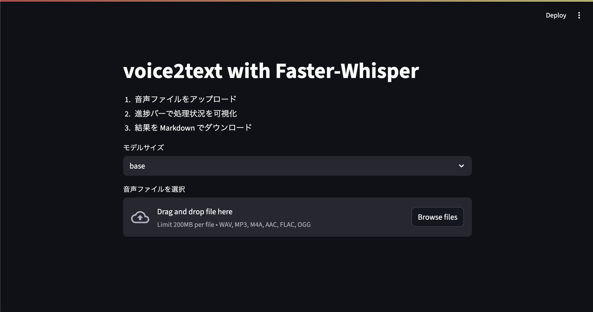

# 🌌 Faster-Whisper Transcriber

<div align="center">



[](https://opensource.org/licenses/MIT)
[](https://www.python.org/)
[](https://nextjs.org/)
[](https://fastapi.tiangolo.com/)
[](https://www.docker.com/)

**音声文字起こし & AI議事録生成の決定版**
<br>
ローカル環境で完結する、高速・高精度・セキュアなAIソリューション

[✨ 特徴](#-features) • [🚀 クイックスタート](#-quick-start) • [🛠️ 構成](#%EF%B8%8F-architecture) • [📸 ギャラリー](#-gallery)

</div>

---

## 🔮 概要

**Faster-Whisper Transcriber** は、最先端のAI技術を融合させた、次世代の音声処理プラットフォームです。

OpenAIの **Whisper** モデルを高速化した **Faster-Whisper** エンジンを搭載し、驚異的なスピードで音声をテキスト化。さらに、**LMStudio** との連携により、ローカルLLMを用いて即座に要約・議事録を作成します。これらすべてが、あなたのマシンの中で完結します。プライバシーは完全に守られます。

## ✨ Features

### ⚡️ Blazing Fast Transcription
**Faster-Whisper** エンジンを採用し、従来のWhisperと比較して最大 **4倍** の推論速度を実現。GPU（CUDA）アクセラレーションにも完全対応。

### 🤖 AI-Powered Summarization
文字起こし結果を **LMStudio** (Local LLM) にシームレスに送信。会議の議事録、要約、アクションアイテムの抽出を自動化します。

### 🎨 Stunning UI/UX
**Aurora Glassmorphism** デザインを採用した、没入感のあるモダンなインターフェース。
- **Drag & Drop**: 直感的なファイル操作
- **Real-time Progress**: 詳細な進捗表示
- **Interactive**: 滑らかなマイクロインタラクション

### 🔒 Privacy First
データは外部サーバーに送信されません。すべての処理はローカルネットワーク内で完結するため、機密性の高い会議データも安全です。

---

## 🚀 Quick Start

**Docker Compose** を使用すれば、コマンド一発で環境が立ち上がります。

```bash
# 1. リポジトリをクローン
git clone https://github.com/yut0takagi/faster-whisper-file-app.git
cd faster-whisper-file-app

# 2. 起動（魔法のコマンド）
docker compose up --build
```

アクセス:
- **Frontend**: [http://localhost:3000](http://localhost:3000)
- **Backend**: [http://localhost:8000](http://localhost:8000)

> 💡 **Note**: 初回起動時のみ、AIモデルのダウンロード（約数GB）が行われます。コーヒーでも飲みながらお待ちください。次回からは爆速で起動します。

---

## 🛠️ Architecture

最新のテックスタックを採用し、パフォーマンスと開発体験を最大化しています。

| Component | Technology | Description |
|-----------|------------|-------------|
| **Frontend** |    | **App Router**, **Server Actions**, **Framer Motion**, **shadcn/ui** を駆使したモダンなSPA。 |
| **Backend** |   | 非同期処理に特化した高速APIサーバー。WebSocket対応。 |
| **AI Engine** |  | CTranslate2ベースの最適化された推論エンジン。int8量子化でメモリ効率を最大化。 |
| **LLM Integration** |  | OpenAI互換APIを通じてローカルLLMと連携。 |

---

## 📖 Usage Guide

### 1. Setup LMStudio (Optional)
議事録生成機能を使用する場合、[LMStudio](https://lmstudio.ai/) をセットアップします。

1. LMStudioを起動し、好みのモデル（例: `openai/gpt-oss-20b`）をロード。
2. **"Local Server"** タブを開き、サーバーをスタート。
3. アプリのサイドバー設定で、API URLを確認（デフォルトで設定済み）。

### 2. Transcribe
1. **Model Size** を選択（`tiny` 〜 `large`）。
2. 音声ファイルをドロップエリアに投げ込むだけ。
3. 魔法のようにテキストが生成されます。

### 3. Generate Minutes
1. 文字起こし完了後、**"Generate Minutes"** ボタンをクリック。
2. AIが内容を分析し、構造化された議事録を出力します。
3. Markdown形式でダウンロードして、NotionやObsidianに貼り付けましょう。

---

## 🐳 Docker & GPU

NVIDIA GPUをお持ちですか？爆速の世界へようこそ。

`docker-compose.yml` のコメントアウトを外すか、以下のコマンドでGPUを有効化して起動します。

```bash
docker compose --profile gpu up --build
```

*※ NVIDIA Container Toolkitのインストールが必要です。*

---

## 📂 Project Structure

```
faster-whisper-file-app/
├── 📂 frontend/          # Next.js 14+ (The Face)
│   ├── 📂 app/           # App Router & Layouts
│   ├── 📂 components/    # Shadcn UI & Motion Components
│   └── 📂 lib/           # Utilities & API Clients
├── 📂 backend/           # FastAPI (The Brain)
│   ├── 📜 main.py        # API Endpoints
│   └── 📜 requirements.txt
├── 📜 docker-compose.yml # Orchestration
└── 📜 README.md          # This File
```

---

## 🤝 Contributing

コントリビューションは大歓迎です！バグ報告、機能追加、UIの改善など、プルリクエストをお待ちしています。

1. Fork it
2. Create your feature branch (`git checkout -b feature/amazing-feature`)
3. Commit your changes (`git commit -m 'Add some amazing feature'`)
4. Push to the branch (`git push origin feature/amazing-feature`)
5. Open a Pull Request

---

## 📜 License

This project is licensed under the MIT License - see the [LICENSE](LICENSE) file for details.

<div align="center">

**Made with ❤️ by Yuto TAKAGI**

</div>
